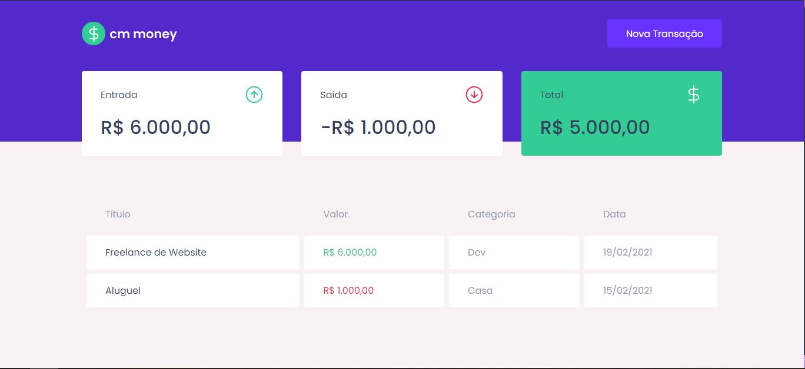
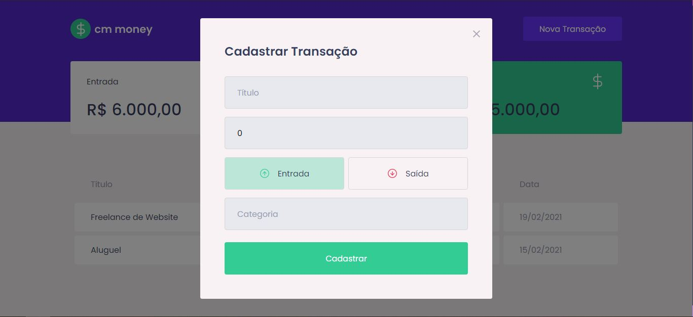

<div align="center">
  
</div>

<br />
<br />

<h4 align="center">
  Cm Money é um projeto desenvolvido para que você se organizar com as sua contas e com o que você recebeu.
 
</h4>

<h4 align="center" >
Você consegue colocar os jobs que fez ou seu salário mensal e colocar o que você gastou e com isso saber o quanto pode ou naõ gastar a mais.
</h4>
<br />
<br />

<h4 align="center"> Tela principal.</h4>


<br /><br />
<h4 align="center"> Tela de entrada e saída</h4>



<br /><br />

## Tecnologias usadas nesse projeto.

<br />

- [ReactJS](https://reactjs.org/)
  <br />
- [Typescript](https://www.typescriptlang.org/)
  <br />
- [Axios](https://axios-http.com/)
  <br />
- [React-Modal](http://reactcommunity.org/react-modal/)
  <br />
- [Styled-Components](https://styled-components.com/)

<br /><br />

## Requerimentos para que você veja o projeto.

<br />

- Você Precisa instalar o [Node.js](https://nodejs.org/en/download/) e [Yarn](https://yarnpkg.com/) ou pode usar o Npm que já vem quando você instala o Nodejs.

  **Clone o projeto e entre na pasta**

```bash
$ git clone https://github.com/cesar-machado/cm-money.git && cd cm-money
```

**Siga os passo abaixo para rodar o projeto**

```bash
# Instalar dependências
$ yarn

#Comece a rodar o projeto
$ yarn start
```

O projeto estará disponível no seu navegador em `http://localhost:3000`

## 📝 License

This project is licensed under the MIT License - see the [LICENSE](LICENSE) file for details.

---

Feito com muito 💜 by César Machado 👋 [Meu LinkedIn](https://www.linkedin.com/in/cesar-mach/)
